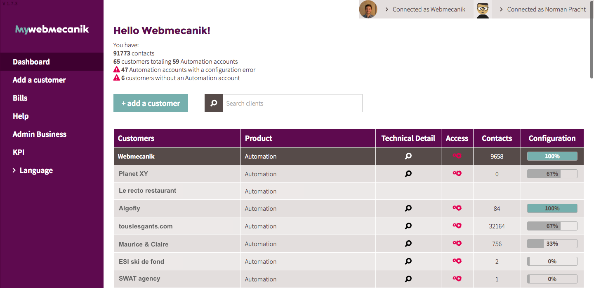

# myWebmecanik
my.Webmecanik ist die Benutzeroberfläche um mehrere Webmecanik Automation Accounts für Agenturen und Webmecanik Partner zu organisieren.
Mit ein paar Klicks können Sie Automation für Ihre Kunden hinzufügen, organisieren und einsetzen !

## Dashboard ##
Mit Ihrem Dashboard im myWebmecanik Portal haben Sie die Möglichkeit Kunden hinzuzufügen, deren myWebmecanik Automation Accounts zu eröffnen, die technischen Details einzustellen und die Anzahl an Kontakten für jede Instanz sowie die gesamte Anzahl zu sehen. Außerdem erstellen Sie hier Ihre Abrechnung.

### Prerequisites
Um zu diesem Punkt zu gelangen, müssen Sie einen Account bei myWebmecanik erstellt haben. Um dies zu tun, [folgen Sie der Anleitung](neuer-account.md) !

# Neuigkeiten #
Entdecken Sie die neuesten Funktionen von myWebmecanik in unseren Video Tutorials!

<iframe width="640" height="360" src="https://www.youtube.com/embed/wh7dLCeIaXU?showinfo=0" frameborder="0" allowfullscreen></iframe>
