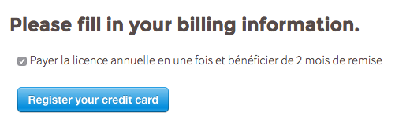
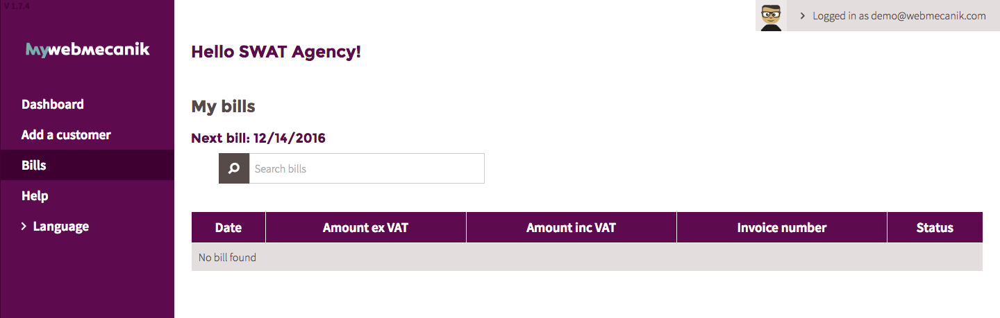

# Abrechnung

## Einleitung

Erstellen Sie automatische monatliche Rechnungen abhängig von Ihrem myWebmecanik Nutzen \(Anzahl von Kontakten und Instanzen\).

## Abrechnungsmethode

myWebmecanik wird Ihre Bankdetails abfragen um jeden Monat Abrechnungen zu erstellen und Rechnungsvolumen zu kalkulieren.

**ANMERKUNG** :  
Sie haben die Möglichkeit den gesamten Betrag Ihres Agenturenpakets \(12 Monate\) am Anfang Ihres Abonnements zu bezahlen um einen Discount von 2 Monaten zu erhalten. Für etwaige zusätzliche Leistungen \(Kontakte und Instanzen\) werden Sie weiterhin monatliche Abrechnungen erhalten.

## Rechnungen ansehen

## Rechnungen erhalten

Standardmäßig erhalten alle Nutzer eine Kopie der monatlichen Rechnungen. Wenn Sie eine weitere E-Mailadresse hinzufügen möchten, die ebenfalls eine Kopie der E-Mail Rechnung erhält, laden Sie diese ein einen Account bei myWebmecanik zu erstellen. Sie können weiterhin einen speziellen Rechnungskontakt\(e\) auswählen, indem Sie: 

1. Klicken Sie auf den Namen Ihres Unternehmens vom Dashboard
2. Bearbeiten Sie das Profil des Kontaktes, bei dem Sie den Status ändern möchten.
3. Machen Sie ein Kreuz bei "Ich bin der Rechnungskontakt" --&gt; Speichern

