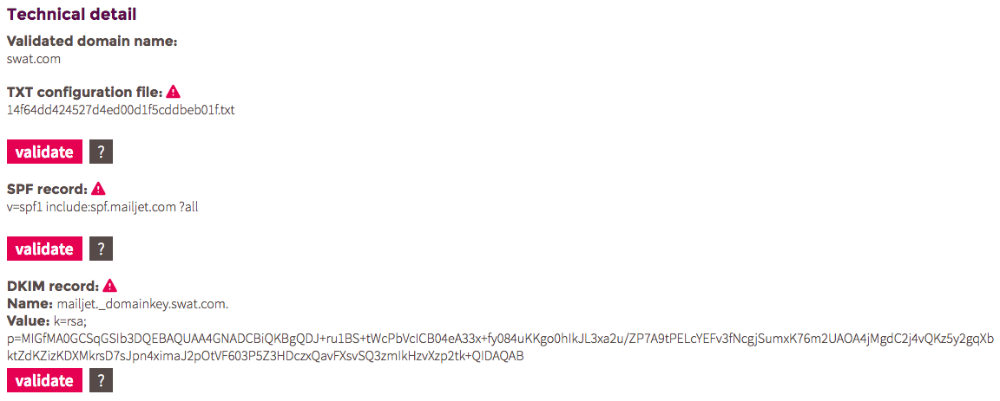

# Eine Instanz erstellen

## Einleitung ##

Den Domain Namen aufzusetzen, um Mails zu senden ist ein wichtiger Schritt.
Ohne diese Einstellung können keine Mails von der Plattform versendet werden.
Sie finden all diese Informationen im technische Details- Bereich der Instanz.

## TXT Datei : Domain Name: Authorisierung der Benutzung ##

Für jeden Account werden Sie gebeten, eine '.txt' Datei zu der Wurzel des Domainnamens hochzuladen (via FTP Zugang). Diese Datei hat einen einzigartigen Namen welcher verifizieren wird, dass Sie der Besitzer der Domain sind und es dem E-Mail Router erlaubt E-Mails in seinem Namen zu senden.

1. Erstellen Sie eine leere Datei mit dem angezeigten Namen (z.B. `jlbzgoh89Y4IOUEOI.txt`)
2. Laden Sie diese Datei zur Wurzel des Domain Namens hoch (die folgende URL zum Beispiel muss zur leeren '.txt' Datei führen):  `http://mydomain.com/jlbzgoh89Y4IOUEOI.txt`)
3. Kehren Sie zurück zu Ihren Instanz Details in myWebmecanik und klicken Sie auf den **bestätigen** Button.

## SPF Umleitung : Verbesserung der Zustellungsrate ##

1. Erstellen Sie einen SPF Eintrag mit den Details von myWebmecanik für die Instanz bei den DNS Einstellungen von Ihrem Domain Namen.

 **Anmerkung** Es kann sein, dass Sie schon einen SPF Eintrag haben. Leider ist es nicht möglich mehrere SPF Einträge zu haben. Konsultieren Sie die [Google Dokumentation für mehrere SPF Einträge](https://support.google.com/a/answer/4568483)
2. Kehren Sie zu den Instanz Details bei myWebmecanik zurück und klicken Sie den **bestätigen** Button.

## DKIM Umleitung : Verbesserung der Zustellungsrate ##

1. Erstellen Sie einen DKIM Eintrag mit den Details von myWebmecanik für die Instanz bei den DNS Einstellungen von Ihrem Domain Namen.
2. Kehren Sie zu den Instanz Details bei myWebmecanik zurück und klicken Sie den **bestätigen** Button.
