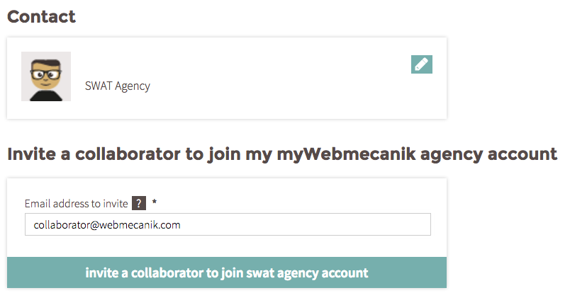

# Einen Mitarbeiter einladen

## Einleitung ##

myWebmecanik ist die Administrationsoberfläche für Ihre Agentur. Es kann sein, dass ein paar Ihrer Mitarbeiter Zugang zum myWebmecanik Account brauchen.
Dafür geben Sie nicht Ihre Login Details weiter, sondern laden die Mitarbeiter einfach ein ihren eigenen Account zu erstellen.
## Ablauf ##

1. Gehen Sie zum [Dashboard](https://my.webmecanik.com)
2. Klicken Sie auf den Kunden, der den Namen Ihrer Agentur hat (erste Zeile).
3. Ganz unten auf der Seite gibt es ein Feld, in das Sie die E-Mail Adressen der Mitarbeiter eintragen können, welche Sie einladen möchten.

**ANMERKUNG** : Alle Benutzer erhalten eine Kopie der monatlichen Rechnungen. Wenn Sie einer bestimmten E-Mailadresse eine Rechnung zusenden möchten, laden Sie sie zur Erstellung eines Accounts bei myWebmecanik ein.
