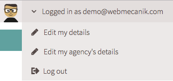

# Nutzer Einstellungen

Jeder Account muss für seinen Nutzer eindeutig sein.Wir empfehlen, seine Login Details nicht weiterzugeben, sondern andere Mitarbeiter einfach zu myWebmecanik einzuladen.  [Mehr Informationen](mitarbeiter-einladen.md).

Im Menü oben rechts können Sie Informationen zum bearbeiten auswählen.

## Meine Info bearbeiten ##

Sie können die Informationen bearbeiten und/oder eingeben, welche Sie als Nutzer betreffen.

## Meine Agentur bearbeiten ##

Sie können die Information über Ihre Firma verändern/eingeben.
Weiterhin können Sie hier auch Ihre Bankdetails verändern.
