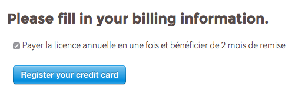
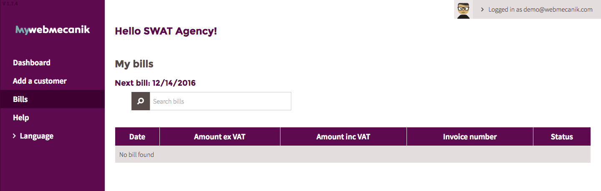

# Billing

## Introduction ##

Automatically generate monthly invoices according to your level of myWebmecanik use (number of contacts and number of instances).

## Billing Method ##

myWebmecanik asks for your bank details to issue and draw invoice amounts each month.

**NOTE** : You have the option of paying the total amount of your agency pack (12 months) at the beginning of your subscription in order to benefit from a discount of 2 months. You will continue to receive monthly invoices for any extra supplements (contacts and instances).

## View Invoices ##

## Receive Invoices ##

All users receive a copy of monthly invoices. If you wish to add another email address to receive a copy of email invoices, invite them to create an account on myWebmecanik.
