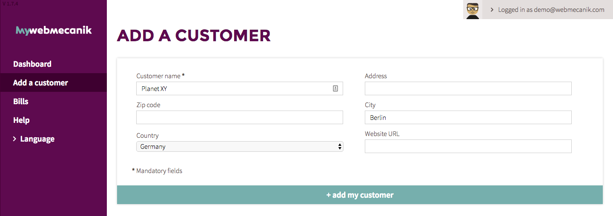

# New Customer

## Introduction ##

myWebmecanik allows you to manage multiple accounts for your clients and their instances of marketing automation. You can add your clients and prospects (which is free), and then deploy their Webmecanik Automation account.

## Adding A Client ##

1. Go to your myWebmecanik dashboard at [my.webmecanik.com/](https://my.webmecanik.com/)
2. Click on the **Add A Client** button.
3. Enter the necessary information and add your new client

Consult [this page to find how to deploy an Automation account](new-instance.md).
