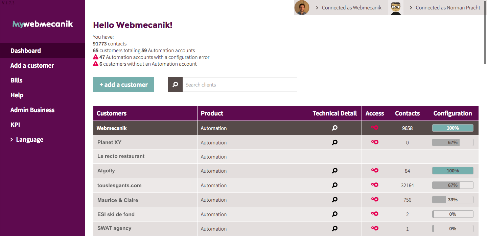

# myWebmecanik
my.webmecanik.com est l'interface de gestion multi-comptes Webmecanik Automation pour les agences et partenaires Webmecanik.
En quelques clics, cela vous permettra de ajouter, gérer et déployer des comptes Automation pour vos clients !

## Tableau de bord ##
Depuis le tableau de bord de votre espace myWebmecanik, vous aurez la possiblité d'ajouter vos clients, leur ouvrir un compte Webmecanik Automation, piloter les paramétrages techniques de leur compte, voir le nombre de contacts de vos clients et la somme de vos contacts mutualisés. Vous pourrez aussi y gérer votre facturation.

### Pré-requis
Pour en arrivez là, vous devez vous créer un compte myWebmecanik, [suivez les instructions ici](new-account.md) !
