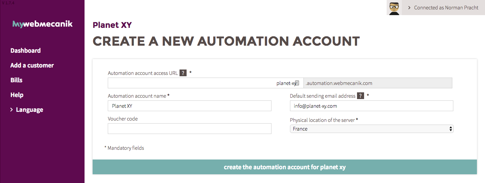

# Nouvelle instance

## Introduction ##

Avec myWebmecanik, vous êtes 100% autonome pour le déploiement de compte Webmecanik Automation pour vos clients.

## Ouvrir un compte Automation ##

1. Allez sur votre [tableau de bord](https://my.webmecanik.com)
2. Cliquez sur le bouton **+ Créer un compte Automation** à côté du nom de votre client (ou du votre)
3. Remplissez les informations pour déployer l'instance. Attention, ces informations sont très importantes, complétez les avec précaution.
  * **URL d'accès au compte Automation** : c'est l'URL qui sera générée pour que vous puissiez accéder au logiciel. Celui n'est pas modifiable.
  * **Nom du compte Automation** : Cette information n'est pas cruciale, donnez un nom à cette instance.
  * **Adresse email d'envoi par défaut** : Le nom de domaine utilisé sur cette adresse devra être configurable (DNS et accès FTP). En effet, vous devrez configurer ce nom de domaine afin d'obtenir l'autorisation de l'utiliser lors du routage des emails. NOTE : Vous pourrez configurer d'autres noms de domaine sur le même compte Automation en faisant la demande au support.
  * **Localisation physique du serveur** : Vous pouvez choisir la localisation de l'hébergement de vos données, en toute tansparence.

### Déploiement du premier compte Automation ##

Au déploiement du premier compte Automation (et parce que c'est le premier), il vous sera demandé de compléter les informations sur vous (l'utilisateur) et votre entreprise.

Ces informations sont nécessaires pour pouvoir vous adresser nos messages d'information et établir la facturation au nom de votre entreprise.

## Accéder au compte Automation ##

* **Accès** : Après quelques minutes, vous recevrez un email de confirmation du déploiement du compte avec vos identifants. L'utilisateur myWebmecanik qui a ouvert le compte Automation sera l'utilisateur créé par défaut dans le compte Automation. C'est lui qui recevra les identifiants de connexion.
* **Utilisation** : La plateforme est déjà opéationnelle, c'est à vous.
* **Paramétrage** : Vous allez recevoir les informations de paramétrage du NDD d'envoi des emails. Sans ce paramétrage, aucun email ne partira de la plateforme. Veuillez lire attentivement ce [chapitre sur le paramétrage technique](instance-settings.md).
